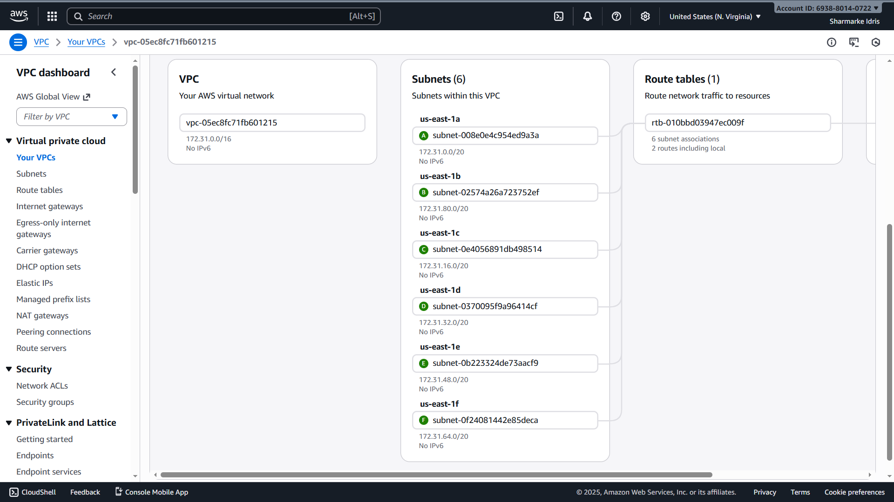

# AWS-Linux-Cloud-Lab
Designed and implemented a secure AWS VPC with public and private subnets, Linux EC2 instances, IAM roles, and access via AWS Systems Manager (SSM).
## VPC Architecture Overview

This project demonstrates a production-style AWS Virtual Private Cloud (VPC) architecture designed with security, scalability, and best practices in mind.

The lab includes:
- A custom VPC with a /16 CIDR block
- Public and private subnets distributed across multiple Availability Zones
- Linux EC2 instances deployed in private subnets
- IAM roles and policies following least-privilege principles
- Secure access to EC2 instances using AWS Systems Manager (SSM)
- Route tables, internet gateway, and controlled outbound access

This project was built to showcase hands-on AWS networking, Linux administration, and cloud security skills relevant to cloud, DevOps, and infrastructure roles.

## What I Built
- Designed and deployed a custom AWS VPC using a /16 CIDR block
- Segmented the network into public and private subnets across multiple Availability Zones
- Configured route tables, internet gateway, and controlled outbound access
- Deployed Linux EC2 instances in private subnets
- Implemented IAM roles with least-privilege permissions
- Enabled secure instance access using AWS Systems Manager (SSM)

## Skills Demonstrated
- AWS Networking (VPC, Subnets, Route Tables, IGW)
- Linux Administration
- IAM & Security Best Practices
- Cloud Architecture Design
- Infrastructure Documentation

